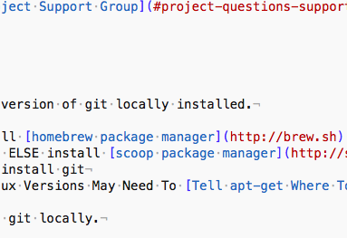

# TRACK + REPORT ON GIT REPO SIZE (automate via hook)

⚠️  Warning: CODE BLOAT IS A BAD SIGN!!

## Table of Contents

- [Prerequisites](#prerequisites)
- [Sample Output](#sample-output)
- [Run Script From Repo Root Manually After Commit](#run-script-from-repo-root-manually-after-commit)
- [Rerun Script From Repo Root Manually After Commit](#rerun-script-from-repo-root-manually-after-commit)
- [Automate Execution As Git Hook](#automate-execution-as-git-hook)
- [Enhancements](#enhancements)
- [Git Repo Stats Project Support Group](#project-questions-support-group)

---

## Prerequisites:

1. We have a current version of git locally installed.

  - OSX:  First install [homebrew package manager](http://brew.sh) and use it to install git: $ brew install git
  - Win: Install []() ELSE install [scoop package manager](http://scoop.sh) and use it to install git: $ scoop install git
  - Linux: $ apt-get install git
    - NOTE: OLDER Linux Versions May Need To [Tell apt-get Where To Find Latest Git](http://lifeonubuntu.com/ubuntu-missing-add-apt-repository-command/)

2. We have configured git locally.

```
$ git config --global user.name "John Appleseed"

$ git config --global user.email "email@example.com"
```

3. We have been using [git](https://git-scm.com/book/en/v2/Getting-Started-About-Version-Control) and [github](http://www.github.com) to manage online project assets, from media to source code.

4. We desire [expert use of git and githob](http://gitready.com/).

5. We want to preemptively avoid code project bloat by tracking our git repo sizes.

⚠️  Warning: CODE BLOAT IS A BAD SIGN!!!!

- [Git Repo Stats Project Support Group](#project-questions-support-group)

## Sample output



## Run script from repo root manually after commit

```
$ bash git-repo-stats.sh
```

## Rerun script from repo root manually after commit

```
$ echo 'blahblahblahblahblahblahblahblahblahblahblahblah' > new file
$ git status
$ git add .
$ git status
$ git commit -m 'Added some stuff.'
$ git status
$ bash git-repo-stats.sh
```

## Automate Execution As Git Hook

```
$ echo '
HOOK SCRIPT
' > git-repo-stats-post-commit-hook.sh

$ cd .git/hooks

$ ln -s ../git-repo-stats-post-commit-hook.sh .

$ git add .

$ git commit -m 'Added automation via post-commit hook.'

$ echo '# ** You should see the output of what you ran manually after each commit going forward. **'
```

## Suggestions to reduce repo size.

⚠️  Warning: CODE BLOAT IS A BAD SIGN!!

1. Add a [.gitgnore file](https://www.atlassian.com/git/tutorials/gitignore) to omit repo sub-directories which we do NOT want to share.

2. Learn about [testing your code](https://stackoverflow.com/questions/3053521/testing-your-code-before-releasing-to-qa) and [tracking dependencies](https://www.ibm.com/developerworks/rational/library/tracking-dependencies-between-requirements-artifacts/index.html).

3. Use [git tree](https://git-scm.com/docs/git-ls-tree) or [git submodule](https://www.atlassian.com/blog/git/git-submodules-workflows-tips).

4. To reduce .git/ subfolder size: delete it, reset project repo, reinitialize with git, add, commit.

```
$ rm -rf .git; git init; git add . ; git commit -m 'First commit or reset repo.'
```

## Enhancements

1. Finish team dev dojo I, II, III.

2. Post about projects on LinkedIn and BigDataProcessing.


## Project Questions Support Group

- [All git-repo-stats Questions](https://www.facebook.com/groups/BigDataProcessing/)
